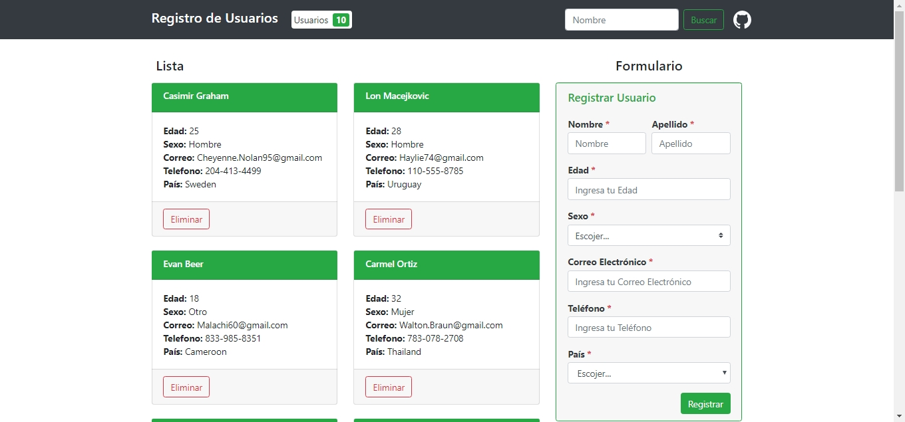

register-react
=

APP WEB con React y API REST con Express para el registro y almacenamiento de usuarios

> [Link App](https://edixonalberto.github.io/register-react/)

### Tecnologías Implementadas

- Libreria para el frontend `React` **16.9.0**
- Framework para la creacion de la interfaces con `Bootstrap` **4.3.1**
- Backend en `Desarrollo...`

**Nota:**

Trabajando en nuevo **branch** para adaptar la interfaz a dos pantallas y manejarlas por medio de las alibrerías: `React-Router-Dom` y `Redux`

### Interfaz

