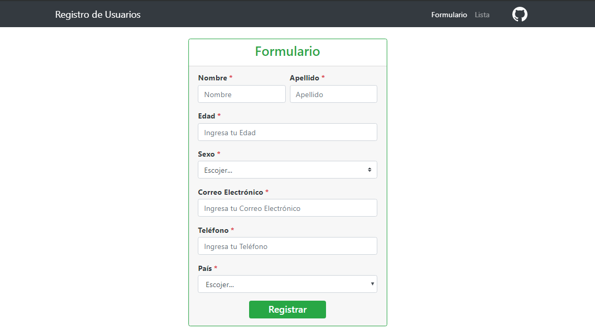
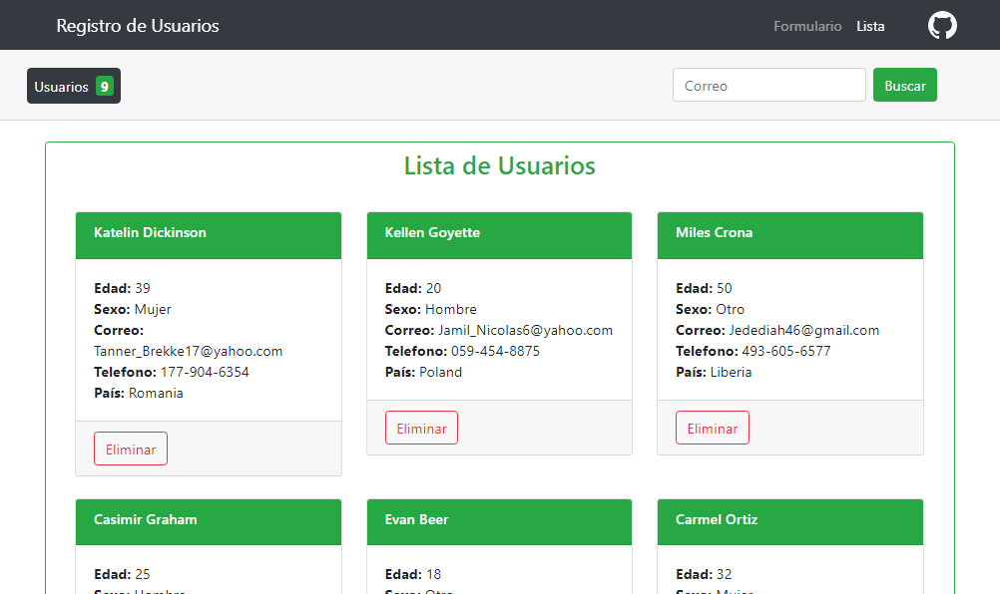

register-react
=

APP WEB con React y backend con Firebase para el registro y almacenamiento de usuarios

> [Link App](https://edixonalberto.github.io/register-react/)

### Tecnologías Utilizadas

**Frontend**
- Libreria `React` **16.9.0**
    + react-router
    + redux
    + react-redux
- Bootstrap **4.3.1**

**Backend**
- Firebase/database
    + api creada a partir de los metodos de firebase usando async/await
- libreria dotenv

### Pantallas

(Pantalla 1)

(Pantalla 2)

